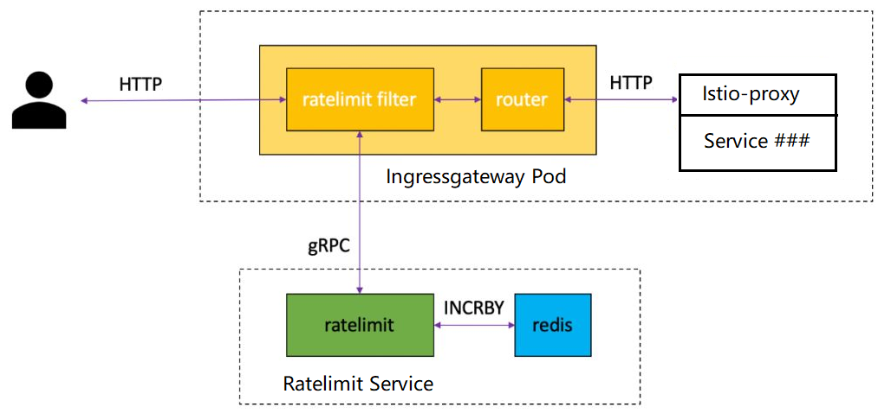

# Enabling Rate Limits using Envoy

This task shows you how to use Envoy's native rate limiting to dynamically limit the traffic to an Istio
service. In this task, you will try global rate-limit on the `productpage` service through ingress gateway. 

There will be two examples in this task.
In order to enchence your understanding, will also show some redis key/value in this example.

## Before you begin

1. Setup Istio in a Kubernetes cluster by following the instructions in the
   [Installation Guide](https://istio.io/v1.9/docs/setup/getting-started/).

1. Deploy the [Bookinfo](https://istio.io/v1.9//docs/examples/bookinfo/) sample application.

## Rate limits

Envoy supports two kinds of rate limiting: global and local. Global rate
limiting uses a global gRPC rate limiting service to provide rate limiting for the entire mesh.
Local rate limiting is used to limit the rate of requests per service instance.

In this task you will configure Envoy to rate limit traffic to a specific path of a service
using both global rate limits.

## Architecture

Envoy can be used to [set up global rate limits](https://www.envoyproxy.io/docs/envoy/latest/intro/arch_overview/other_features/global_rate_limiting) for your mesh.
Global rate limiting in Envoy uses a gRPC API for requesting quota from a rate limiting service.
A [reference implementation](https://github.com/envoyproxy/ratelimit) of the API, written in Go with a Redis
backend, is used below.



### Example 1
#### Requirments
- For productpage api, allows 1 requests per minute  
- For other api, allows 10 requests per minute

#### Apply files
```
kubectl apply -f ./example01/
```
#### Verify the results
```
$ curl "http://$GATEWAY_URL/productpage"
# Try first time, return 200.
# Try second time, return 429.

$ curl "http://$GATEWAY_URL/api/v1/products"
# Try first ten times, return 200.
# Try once more, return 429.
```
#### View redis to understand more
The redis store the access times for each action.
```
127.0.0.1:6379> KEYS *
1) "productpage-ratelimit_PATH_/productpage_1615455060"
2) "productpage-ratelimit_PATH_/api/v1/products_1615455120"
127.0.0.1:6379> GET "productpage-ratelimit_PATH_/api/v1/products_1615455120"
"11"
```
#### Understand the config files
1. Below are deployment and service for ratelmit, redis.
    ```
    cat ./example01/20-service-ratelimit-redis.yaml
    ```

1. Use the following configmap to [configure the reference implementation](https://github.com/envoyproxy/ratelimit#configuration)
    to rate limit requests to the path `/productpage` at 1 req/min and all other requests at 10 req/min.
    ```
    apiVersion: v1
    kind: ConfigMap
    metadata:
      name: ratelimit-config
      namespace: ratelimit
    data:
      config.yaml: |
        domain: productpage-ratelimit
        descriptors:
          - key: PATH
            value: "/productpage"
            rate_limit:
              unit: minute
              requests_per_unit: 1
          - key: PATH
            rate_limit:
              unit: minute
              requests_per_unit: 10
    ```

1. Apply an `EnvoyFilter` to the `ingressgateway` to enable global rate limiting using Envoy's global rate limit filter. 
    The first patch inserts the
    `envoy.filters.http.ratelimit` [global envoy filter](https://www.envoyproxy.io/docs/envoy/latest/api-v3/extensions/filters/http/ratelimit/v3/rate_limit.proto#envoy-v3-api-msg-extensions-filters-http-ratelimit-v3-ratelimit) filter into the `HTTP_FILTER` chain.
    The `rate_limit_service` field specifies the external rate limit service, `rate_limit_cluster` in this case.
    The second patch defines the `rate_limit_cluster`, which provides the endpoint location of the external rate limit service.
    ```
    cat ./example01/30-envoyfilter-ratelimit.yaml
    ``` 

1. Apply another `EnvoyFilter` to the `ingressgateway` that defines the route configuration on which to rate limit.
    This adds [rate limit actions](https://www.envoyproxy.io/docs/envoy/latest/api-v3/config/route/v3/route_components.proto#envoy-v3-api-msg-config-route-v3-ratelimit)
    for any route from a virtual host named `*.80`.

    ```
    cat ./example01/40-envoyfilter-ratelimit-svc.yaml
    ```
#### Clean up
```
kubectl delete -f ./example01/
```

### Example 2
#### Requirments
Make it is more complex
- For http header X-HPBP-Tenant-ID is tenant01, 5 times/min
- For http header X-HPBP-Tenant-ID is tenant02, 8 times/min
- For http header X-HPBP-Tenant-ID is other value, 3 times/min
- For other api, allows 10 requests per minute

#### Apply files
```
kubectl create -f ./example02/
```
#### Verify the results
```
$ curl "http://$GATEWAY_URL/productpage" -H "X-HPBP-Tenant-ID: tenant01" -v
# Try first five times, return 200.
# Try sixth time, return 429.

$ curl "http://$GATEWAY_URL/productpage" -H "X-HPBP-Tenant-ID: tenant02" -v
# Try first eight times, return 200.
# Try ninth time, return 429.

$ curl "http://$GATEWAY_URL/productpage" -H "X-HPBP-Tenant-ID: tenant03" -v
# Try first three times, return 200.
# Try fourth time, return 429.

$ curl "http://$GATEWAY_URL/productpage" -H "X-HPBP-Tenant-ID: othervalue" -v
# Try first three times, return 200.
# Try fourth time, return 429.

$ curl "http://$GATEWAY_URL/api/v1/products"
# Try first ten times, return 200.
# Try once more, return 429.
```

`$GATEWAY_URL` is the value set in the [Bookinfo](https://istio.io/v1.9//docs/examples/bookinfo/) example.


#### View redis to understand more
The redis store the access times for each action.
```
127.0.0.1:6379> KEYS *
1) "productpage-ratelimit_PATH_/productpage_TENANTID_tenant03_1615466880"
2) "productpage-ratelimit_PATH_/productpage_TENANTID_tenant02_1615466880"
3) "productpage-ratelimit_PATH_/api/v1/products_1615466940"
4) "productpage-ratelimit_PATH_/productpage_TENANTID_tenant01_1615466820"
5) "productpage-ratelimit_PATH_/productpage_TENANTID_othervaule_1615466880"
127.0.0.1:6379> GET "productpage-ratelimit_PATH_/productpage_TENANTID_tenant01_1615466820"
"6"
127.0.0.1:6379> GET "productpage-ratelimit_PATH_/productpage_TENANTID_othervaule_1615466880"
"4"
```
#### Understand the config files
1. Below are deployment and service for ratelmit, redis.  
   `Same with example01` 
    ```
    cat ./example02/20-service-ratelimit-redis.yaml
    ```

1. Use the following configmap to rate limit requests to the path `/productpage`, different limits based on different tenant
    ```
    apiVersion: v1
    kind: ConfigMap
    metadata:
      name: ratelimit-config
      namespace: ratelimit
    data:
      config.yaml: |
        domain: productpage-ratelimit
        descriptors:
          - key: PATH
            value: "/productpage"
            descriptors:
              - key: TENANTID
                value: tenant01
                rate_limit:
                  unit: minute
                  requests_per_unit: 5
              - key: TENANTID
                value: tenant02
                rate_limit:
                  unit: minute
                  requests_per_unit: 8
              - key: TENANTID
                rate_limit:
                  unit: minute
                  requests_per_unit: 3
          - key: PATH
            rate_limit:
              unit: minute
              requests_per_unit: 10
    ```

1. Apply an `EnvoyFilter` to the `ingressgateway` to enable global rate limiting using Envoy's global rate limit filter. 
   `Same with example01` 
    ```
    cat ./example02/30-envoyfilter-ratelimit.yaml
    ``` 

1. Apply another `EnvoyFilter` to the `ingressgateway` that defines the route configuration on which to rate limit.
    This adds more [rate limit actions](https://www.envoyproxy.io/docs/envoy/latest/api-v3/config/route/v3/route_components.proto#envoy-v3-api-msg-config-route-v3-ratelimit)
    based on new requriments.

    ```
    cat ./example02/40-envoyfilter-ratelimit-svc.yaml
    ... ...
        value:
          rate_limits:
            - actions: # more actions based on new requirment
              - request_headers:
                  header_name: ":path"
                  descriptor_key: "PATH"
              - request_headers:
                  header_name: "X-HPBP-Tenant-ID"
                  descriptor_key: "TENANTID"
            - actions: # actions in example01
              - request_headers:
                  header_name: ":path"
                  descriptor_key: "PATH"
    ... ...
    ```

#### Clean up
```
kubectl delete -f ./example02/
```

